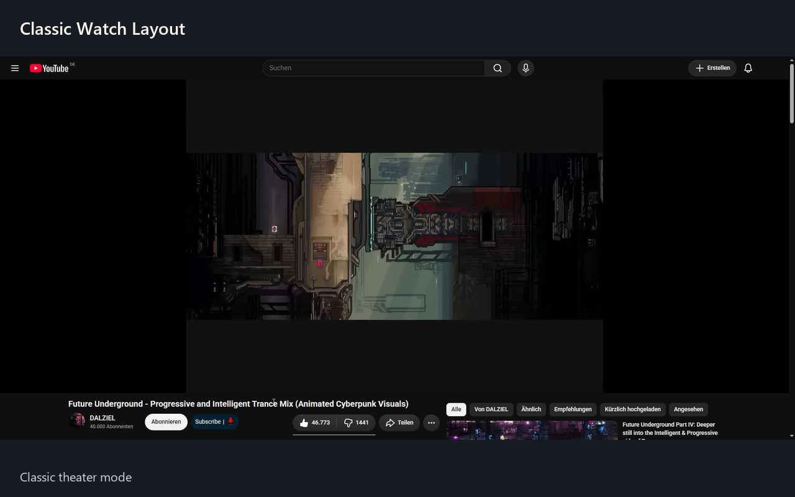

# Classic Theater Mode for YouTube

A small extension that restores the classic theater mode for affected YouTube accounts.

## Installation

**Chrome Web Store: not available yet.** A direct installation link will be added here once the extension is published.

### Alternative: manual installation

1. Download and extract the ZIP file.
2. Open `chrome://extensions` or `brave://extensions`, enable **Developer mode**, and click **Load unpacked**.
3. Select the extracted folder containing `manifest.json`, then reload YouTube.

To undo the changes, disable or remove the extension and reload YouTube.

## Contact

[Report an issue](https://github.com/ctrwins/classic-watch-layout/issues) · [Email](mailto:ctrwins@googlemail.com) · [Privacy policy](docs/privacy.md)

Not affiliated with YouTube or Google. Results may vary depending on your account and YouTube's current layout.

## License

The project code and original assets are licensed under the [MIT License](LICENSE). You may use, modify, fork and redistribute them, including commercially, provided you retain the copyright and license notices.

Third-party content and trademarks shown in screenshots remain the property of their respective owners and are not covered by this license.
